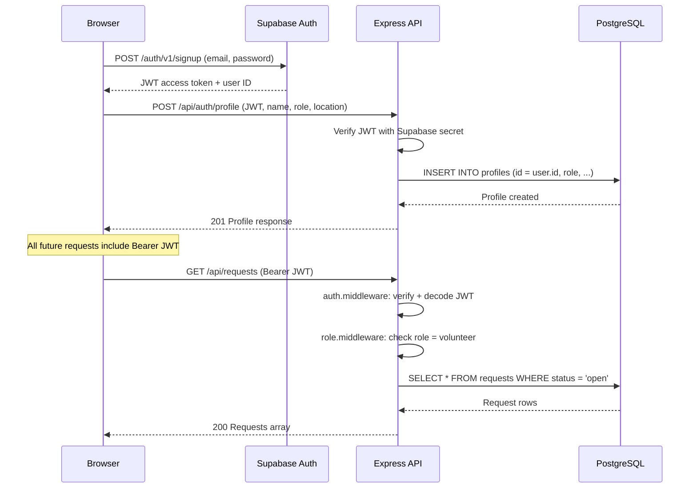
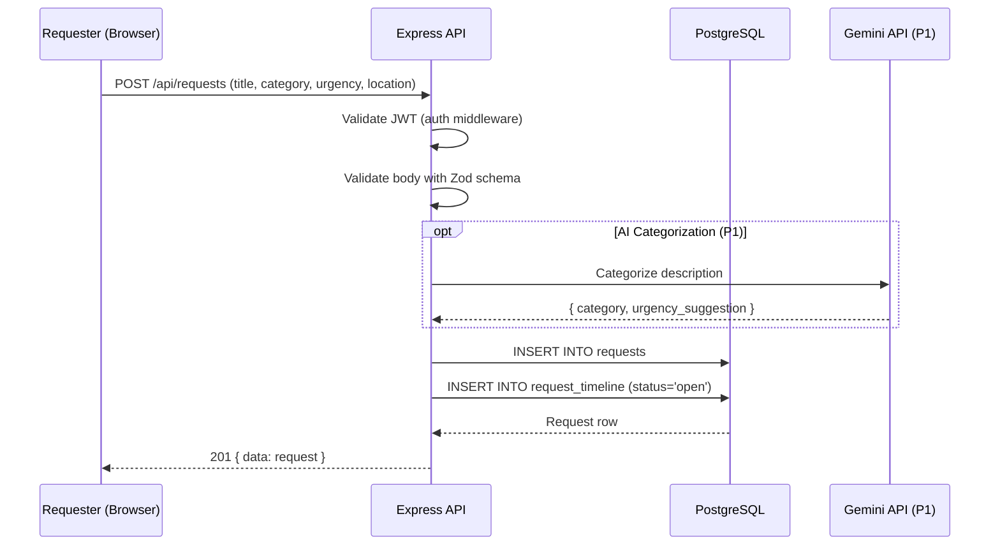
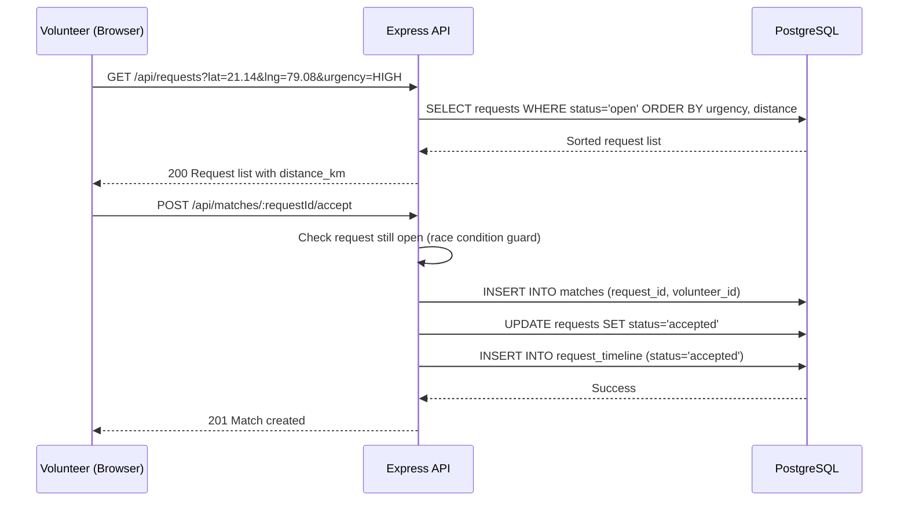
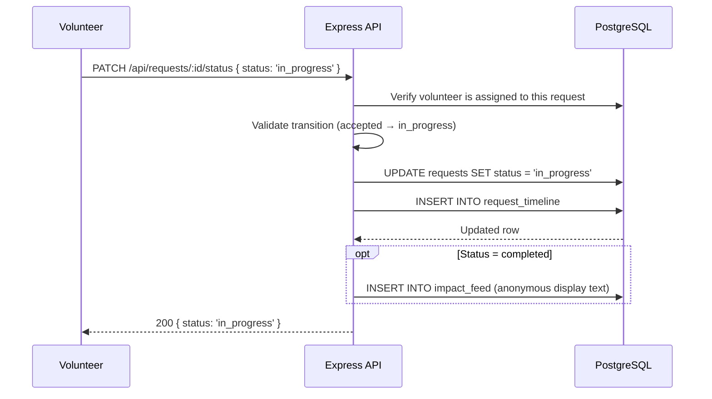
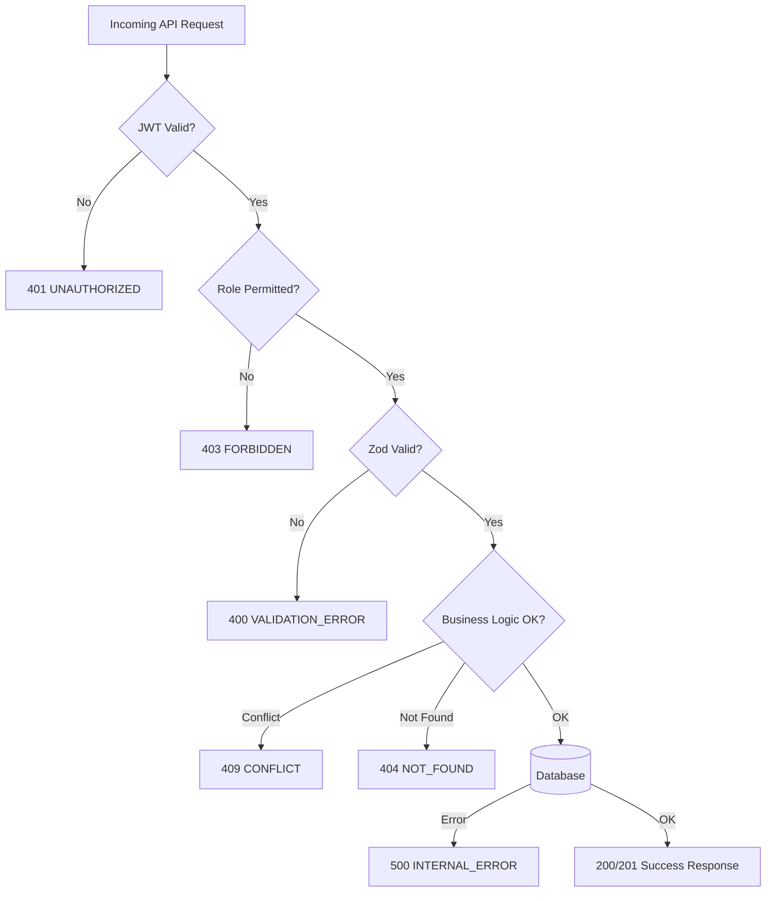

# SYSTEM-DESIGN.md — Architecture & Data Flow

## High-Level Architecture

```
┌─────────────────────────────────────────────────────────┐
│                        BROWSER                          │
│                   Next.js (Vercel)                      │
│  ┌──────────────────────────────────────────────────┐   │
│  │  App Router  │  Components  │  React Hook Form   │   │
│  └──────────────────────────────────────────────────┘   │
└──────────────┬───────────────────────┬──────────────────┘
               │  REST API calls        │ Supabase Auth
               │  (JWT in header)       │ (direct from browser)
               ▼                        ▼
┌──────────────────────┐    ┌────────────────────────────┐
│  Express.js (Render) │    │      Supabase Auth          │
│  Node.js + TypeScript│    │  (JWT issuance / session)   │
│  ┌─────────────────┐ │    └────────────────────────────┘
│  │ auth middleware │ │
│  │ role middleware │ │    ┌────────────────────────────┐
│  │ zod validation  │ │    │        Supabase             │
│  │ controllers     │ ├───►│   PostgreSQL (6 tables)     │
│  │ services        │ │    │   RLS enforced              │
│  │ matching logic  │ │    └────────────────────────────┘
│  └─────────────────┘ │
│  ┌─────────────────┐ │    ┌────────────────────────────┐
│  │  Gemini API     │ │    │      Supabase Storage       │
│  │  (P1, optional) │ │    │  (profile images, P1)       │
│  └─────────────────┘ │    └────────────────────────────┘
└──────────────────────┘
```

---

## Component Architecture

### Frontend Components

```
app/
├── (auth)/
│   ├── login/page.tsx
│   └── register/page.tsx
├── (requester)/
│   ├── dashboard/page.tsx
│   ├── requests/new/page.tsx
│   ├── requests/my/page.tsx
│   └── requests/[id]/page.tsx
├── (volunteer)/
│   ├── dashboard/page.tsx
│   └── requests/page.tsx
├── (ngo)/
│   └── dashboard/page.tsx
└── page.tsx (landing)

components/
├── shared/
│   ├── RequestCard.tsx
│   ├── StatusBadge.tsx
│   ├── UrgencyBadge.tsx
│   ├── StatusStepper.tsx
│   ├── CategoryIcon.tsx
│   └── ImpactTicker.tsx
├── requester/
│   ├── RequestForm.tsx
│   └── RequestTracker.tsx
└── volunteer/
    ├── RequestFeed.tsx
    ├── AcceptButton.tsx
    └── VolunteerStats.tsx
```

---

## Authentication Flow



---

## Request Creation Flow



---

## Matching Flow



---

## Status Update Flow



---

## Error Flow



---

## Matching Algorithm (Backend Logic)

```typescript
// services/matching.service.ts

function calculateDistance(lat1: number, lng1: number, lat2: number, lng2: number): number {
  // Haversine formula — returns distance in km
  const R = 6371;
  const dLat = toRad(lat2 - lat1);
  const dLng = toRad(lng2 - lng1);
  const a = Math.sin(dLat/2)**2 + Math.cos(toRad(lat1)) * Math.cos(toRad(lat2)) * Math.sin(dLng/2)**2;
  return R * 2 * Math.atan2(Math.sqrt(a), Math.sqrt(1-a));
}

const URGENCY_SCORE = { CRITICAL: 4, HIGH: 3, MEDIUM: 2, LOW: 1 };

function sortRequests(requests: Request[], volunteerLat: number, volunteerLng: number) {
  return requests
    .map(r => ({
      ...r,
      distance_km: calculateDistance(volunteerLat, volunteerLng, r.lat, r.lng),
      sort_score: URGENCY_SCORE[r.urgency] * 10 - (distance_km * 0.5)
    }))
    .sort((a, b) => b.sort_score - a.sort_score);
}
```

---

## Deployment Architecture

```
                    ┌──────────────────────┐
                    │        Vercel         │
                    │   civicbridge.vercel  │
                    │   Next.js Frontend    │
                    │   ─ SSR / Static      │
                    │   ─ Edge CDN          │
                    └──────────┬───────────┘
                               │ HTTPS
                               ▼
                    ┌──────────────────────┐
                    │        Render         │
                    │ civicbridge-api       │
                    │ .onrender.com         │
                    │   Express.js API      │
                    │   ─ Auto-deploy main  │
                    └──────────┬───────────┘
                               │ HTTPS (service role key)
                               ▼
                    ┌──────────────────────┐
                    │       Supabase        │
                    │  ─ PostgreSQL DB      │
                    │  ─ Auth service       │
                    │  ─ Storage (P1)       │
                    └──────────────────────┘
```

---

## Data Flow Summary

```
WRITE PATH:
Browser Form → Zod Validation (frontend)
→ Express API → Zod Validation (backend)
→ auth.middleware → role.middleware
→ Controller → Service
→ Supabase JS Client (service role)
→ PostgreSQL (RLS does NOT apply to service role)

READ PATH:
Browser → Express API → Controller
→ Supabase JS Client
→ PostgreSQL → Response
→ Optional: distance sort in-memory

AUTH PATH (direct):
Browser → Supabase Auth (bypass Express)
→ JWT returned to browser
→ JWT sent to Express on every API call
→ Express verifies JWT with Supabase JWT secret
```

---

## Race Condition Handling

The accept request flow has a race condition risk:
Two volunteers click Accept simultaneously.

**Solution:** `UNIQUE(request_id)` constraint on `matches` table.
- First INSERT succeeds
- Second INSERT fails with `23505 unique_violation`
- Backend catches → returns `409 CONFLICT`
- Frontend shows: "Sorry, this request was just accepted by someone else."
